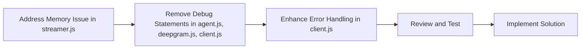

# Phase 2 Plan

## Objective
Analyze compiled issues, prioritize them, and develop a structured plan for addressing each in Phase 2.

### Identified Issues
1. In `js/audio/streamer.js`, there's a check to limit processing buffer size to prevent memory issues.
2. In `js/main/agent.js`, there are console debug statements for model speech transcription and user speech transcription.
3. In `js/transcribe/deepgram.js`, there are console debug statements for sending configuration and receiving WebSocket messages.
4. In `js/ws/client.js`, there are console debug statements for sending and receiving messages, as well as error handling for WebSocket communication.

### Plan
1. **Address the potential memory issue in `js/audio/streamer.js`**:
   - Ensure the processing buffer size is properly limited to prevent memory issues.
   - Review the buffer management logic to optimize memory usage.

2. **Remove console debug statements**:
   - Identify and remove console debug statements in `js/main/agent.js`, `js/transcribe/deepgram.js`, and `js/ws/client.js`.
   - Replace console debug statements with proper logging mechanisms if needed.

3. **Enhance error handling**:
   - Review error handling in `js/ws/client.js` for WebSocket communication.
   - Implement robust error handling to ensure the application remains stable in case of WebSocket errors.

### Mermaid Diagram

### Deliverables
- Updated `js/audio/streamer.js` with optimized buffer management.
- Updated `js/main/agent.js`, `js/transcribe/deepgram.js`, and `js/ws/client.js` with removed debug statements and enhanced logging.
- Verification that the application remains stable and functional.